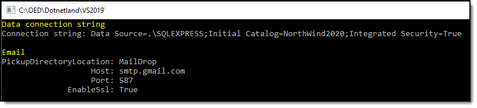

# About

Samples for working with appsettings.json

### Example



### Project dependency

[ConfigurationHelper](https://github.com/karenpayneoregon/EntityFrameworkCore_VisualBasic/tree/master/ConfigurationHelper)

**json**
```json
{
  "GeneralSettings": {
    "LogExceptions": false,
    "DatabaseSettings": {
      "DatabaseServer": ".\\SQLEXPRESS",
      "Catalog": "NorthWind2020",
      "IntegratedSecurity": true,
      "UsingLogging": true
    },
    "EmailSettings": {
      "Host": "smtp.gmail.com",
      "Port": 587,
      "EnableSsl": true,
      "DefaultCredentials": false,
      "PickupDirectoryLocation": "MailDrop"
    }
  }
}
```
**read settings**

```csharp
Imports System
Imports ConfigurationHelper
Imports ConfigurationHelper.Classes

Module Program
    Sub Main(args As String())

        WriteSection("Data connection string")
        Console.WriteLine($"Connection string: {GeneralSettings().DatabaseSettings.ConnectionString}")

        Console.WriteLine()

        WriteSection("Email")
        Console.WriteLine($"PickupDirectoryLocation: {GeneralSettings().EmailSettings.PickupDirectoryLocation}")
        Console.WriteLine($"                   Host: {GeneralSettings().EmailSettings.Host}")
        Console.WriteLine($"                   Port: {GeneralSettings().EmailSettings.Port}")
        Console.WriteLine($"              EnableSsl: {GeneralSettings().EmailSettings.EnableSsl}")


        Console.ReadLine()
    End Sub
    Public Function GeneralSettings() As GeneralSettings
        Return Helper.Configuration()
    End Function
    Public Sub WriteSection(message As String)
        Dim originalForeColor = Console.ForegroundColor

        Console.ForegroundColor = ConsoleColor.Yellow

        Console.WriteLine(message)
        
        Console.ForegroundColor = originalForeColor
    End Sub

End Module
```

# Get source

In either case once cloned, perform a NuGet restore packages.

* Clones https://github.com/karenpayneoregon/EntityFrameworkCore_VisualBasic to get all projects.

Or

* Create a batch file in a temp folder, add the following and run the batch file to get only the two projects required.

```batch
mkdir code
cd code
git init
git remote add -f origin https://github.com/karenpayneoregon/EntityFrameworkCore_VisualBasic
git sparse-checkout init --cone
git sparse-checkout add ConfigurationHelper
git sparse-checkout add ConfigurationHelperSamples
git pull origin master
:clean-up
del .gitattributes
del .gitignore
del .yml
del .editorconfig
del *.md
del *.sln
```